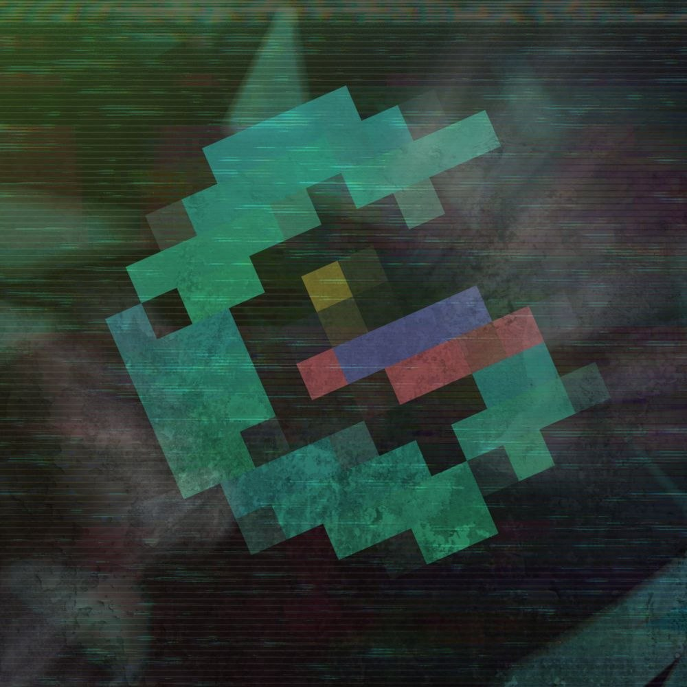

  <h1>Agentic AI Hackathon 2025 🚀</h1>

  

   

  &nbsp;
  

   

  &nbsp;
  &nbsp;
  

   

  <a href="./CODE_OF_CONDUCT.md">🤝 Code of Conduct</a> • 
  <a href="./WELCOME.md">👋 Welcome Guide</a>

## 🧠 About Gen AI Philippines  
At **Gen AI Philippines**, we empower Filipinos to explore and build with generative AI by addressing both technical and non-technical challenges. From misinformation to responsible AI use, we believe in promoting innovation rooted in ethics and real-world impact.

---

## 🎯 Hackathon Overview  
The **Agentic AI Hackathon** is a mission-driven innovation sprint where participants build solutions using AI agents. Whether it’s a single agent automating a process or multiple agents working in sync—this is your playground for cutting-edge AI exploration.

---

## 💡 Challenge Tracks  

### 🧩 Agentic Innovation  
- **Single-Agent Solutions** – Build an app that uses one AI agent to perform tasks efficiently.  
- **Multi-Agent Systems** – Develop collaborative agents that communicate and solve complex problems together.

---

## 📅 Timeline  

| Date | Event |
|------|-------|
| **March 20, 2025** | Registration Opens |
| **April 06, 2025** | Registration Deadline |
| **April 08, 2025** | Shortlisted Teams |
| **April 10, 2025** | Kick-off Event (Begin building selected project ideas) |
| **April 13, 2025** | Session 1: Agents Workshop |
| **April 26, 2025** | Session 2: Fine-tuning Workshop |
| **May 03, 2025** | Session 3: Multi-agentic Workshop |
| **May 10, 2025** | Session 4: Deploying AI Agent on Applications |
| **May 30, 2025** | Pitch Deck Submission |
| **June 15, 2025** | Demo and Video Submission |
| **June 30, 2025** | Demo Day & Finals |

---

## 🚀 Getting Started  

### Prerequisites  
- Basic understanding of AI and programming  
- GitHub account  
- Local dev environment (Python, Node.js, etc. depending on stack)

### Registration Steps  
1. Fill out the [registration form](#) *(opens March 20)*  
2. Submit your **project idea** along with your registration  
3. Join our Telegram community  
4. Form or join a team (2–3 members)  
5. If selected, you’ll start building your project during the **Kick-off Event on April 10**

---

## 📚 Resources  
- Workshop Materials  
- API Documentation  
- Development Guidelines  
- Submission Templates  

(*All links will be provided during the hackathon via email/Discord.*)

---

## 🏆 Prizes  
*TBA* — Stay tuned for exciting rewards, startup funding opportunities, and more!

---

## 📋 Rules and Guidelines  
1. Teams of 2–3 members only  
2. All code must be original and created during the hackathon  
3. Open-source libraries and APIs are allowed  
4. Projects must align with one of the challenge tracks  
5. Submission must include:
   - Source code (on GitHub)  
   - Documentation  
   - Demo video or walkthrough  
6. **Only fresh and original ideas are allowed.**  
   - Projects that have **already received funding** or  
   - **Previously won other hackathons or competitions**  
   will **not be eligible** for this hackathon.

---

## 📬 Contact  

- ✉️ Email: [admin@genaiphbuilders.org](mailto:admin@genaiphbuilders.org)  
- 🔗 LinkedIn: [Gen AI Philippines](https://www.linkedin.com/company/gen-ai-philippines/?viewAsMember=true)  
- 💻 GitHub: [GenAIPHBuilders](https://github.com/GenAIPHBuilders-org)

---

Let’s build the future, one agent at a time. 💡
